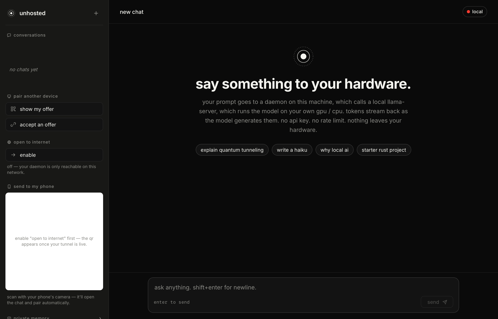
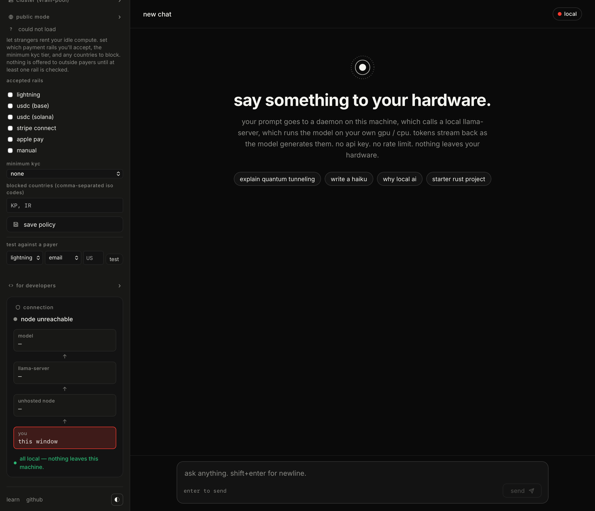
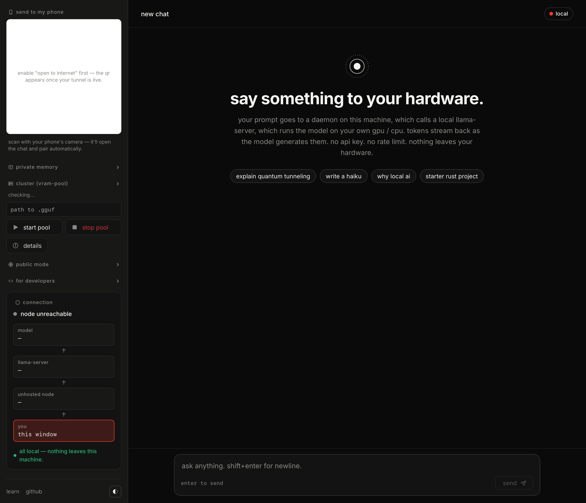

<p align="center">
  
</p>

<p align="center">
  <strong>AI that lives where you do.</strong><br>
  Frontier-class inference on hardware you own.
</p>

<p align="center">
  <a href="MANIFESTO.md">manifesto</a> ·
  <a href="#trust-radius">how it works</a> ·
  <a href="#whats-honest">what's honest</a> ·
  <a href="#roadmap">roadmap</a> ·
  <a href="BRAND.md">brand</a>
</p>

---

> **Status: pre-alpha.** Reading this README is currently the only thing that works. The manifesto is real. The product is being built in public.

## Screenshots

<table>
  <tr>
    <td><a href="assets/screenshots/01-overview.png"></a><br><sub><b>Overview.</b> Default view: chat composer + sidebar.</sub></td>
    <td><a href="assets/screenshots/02-chat.png"></a><br><sub><b>Chat.</b> A running conversation with the local upstream.</sub></td>
  </tr>
  <tr>
    <td><a href="assets/screenshots/03-public-mode.png"></a><br><sub><b>Public mode.</b> Rail checkboxes + KYC + sanctions-default block-list.</sub></td>
    <td><a href="assets/screenshots/04-vram-pool.png"></a><br><sub><b>VRAM pool.</b> Layer-split inference across paired peers.</sub></td>
  </tr>
</table>

> Don't see images? They're regenerated per release. On macOS run `./scripts/screenshots.sh` to populate them locally; see [assets/screenshots/README.md](assets/screenshots/README.md) for the manual path.

## What it is

Unhosted pools the computers you already own — and, optionally, the computers your friends own, and beyond that a public swarm of strangers' GPUs — into a single inference cluster. One endpoint. Mac, Linux, Windows. CUDA, Metal, ROCm.

Run Llama 70B across a MacBook and a 4090. Run smaller models on a Pi mesh. Your hardware. Your model. Your data.

## Trust radius

Unhosted has three modes. You decide how far the radius goes.

```
       ╭───────────────────────────────╮
       │   public · pay (USDC)         │   strangers' GPUs, opt-in
       │   ╭───────────────────────╮   │
       │   │  trusted · free       │   │   friends, family, team
       │   │   ╭───────────────╮   │   │
       │   │   │ local · free  │   │   │   devices you own
       │   │   ╰───────────────╯   │   │
       │   ╰───────────────────────╯   │
       ╰───────────────────────────────╯
```

- **Local** — your laptop, gaming PC, home server. No internet required.
- **Trusted** — your roommate's PC, your homelab, your team. End-to-end encrypted, no public exposure, no payment.
- **Public** — a swarm of strangers renting idle GPUs in exchange for USDC per token. You set a price ceiling. Used only when your circle can't fulfill the request.

The first two are free forever. The third is the safety net. You can use Unhosted for the rest of your life and never spend a dollar.

## Quickstart

> Aspirational. The CLI does not exist yet. This block describes the day-one product.

```bash
# install
curl -fsSL https://unhosted.dev/install | sh

# add a node on your LAN
unhosted node add 192.168.1.42

# pair with a trusted peer over the internet
unhosted peer pair friend@example.com

# run inference (local first, trusted next, public last)
unhosted run llama3.1:70b "explain quantum tunneling"

# cap public-swarm spend
unhosted config set public.max-usd-per-month 5
```

## What's honest

This section replaces the typical "Features" list. It's the truth about what works:

| Capability                    | Status      | Notes                                                              |
|-------------------------------|-------------|--------------------------------------------------------------------|
| Single-machine inference      | shipped     | v0.0.1. Wraps llama.cpp `llama-server`. Smoke-tested on M-series.  |
| LAN cluster (request routing) | shipped     | v0.0.2. Round-robin across local + peers; verified end-to-end.     |
| mDNS peer discovery + pairing | shipped     | v0.0.3. One-click pair in the app sidebar; hot-reload routing.     |
| Model management (`unhosted pull`) | shipped | v0.0.3. Known short names + direct GGUF URL support.               |
| VRAM-pooling (layer splitting) | building   | v0.0.4+. Needs llama.cpp built with `-DGGML_RPC=ON`.              |
| Trusted-peer pairing          | designed    | v0.1.0. WireGuard-style.                                           |
| Public swarm (USDC)           | designed    | v0.3.0+. See [design/0001](design/0001-public-mode-architecture.md). |
| Verifiable inference          | research    | Optimistic + redundancy planned; ZK proofs when affordable.        |
| Web UI / desktop app          | shipped     | Web UI in the daemon since v0.0.3. Tauri desktop shell + auto-updater in v0.0.7. See [design/0002](design/0002-application-frontends.md). |
| Cross-device chat history     | shipped     | v0.0.7. Daemon-side store at `~/.config/unhosted/chats.json`; phones over LAN/tunnel see the same chats as desktop. |
| Public reach (Cloudflare Tunnel) | shipped  | v0.0.7. One-click sidebar button; phone PWA works on cellular. |
| Windows GPU support           | designed    | After Mac + Linux are stable.                                      |

Reproducible benchmarks land in `benchmarks/` once any code exists. We will publish honest tokens-per-second numbers, not marketing language.

## Plugins

The MCP server in [`unhosted-plugins`](https://github.com/unhosted-ai/unhosted-plugins) lets MCP-aware host apps (Claude Desktop, Cursor, Zed) call into your local daemon — `unhosted_status`, `unhosted_web_fetch`, `unhosted_memory_*`, `unhosted_vram_pool_status`. One command wires it up:

```bash
unhosted mcp install claude-desktop   # writes ~/Library/Application Support/Claude/claude_desktop_config.json
unhosted mcp install cursor           # writes ~/.cursor/mcp.json
unhosted mcp install zed              # writes ~/.config/zed/settings.json
```

Each command merges into the host's existing config (preserves your other MCP servers), backs up the original to `<file>.unhosted.bak` once, and is idempotent. Use `unhosted mcp print <host>` to see the snippet without writing. Pass `--daemon-url` + `--bearer` to point the host at a daemon behind a tunnel.

## Roadmap

1. Single-host inference wrapping llama.cpp (Mac, Linux)
2. Two-host LAN cluster running Llama 3.1 70B end-to-end
3. Three benchmark configurations published with reproducible scripts
4. Trusted-peer mode (friend cluster over WireGuard)
5. Public swarm MVP (testnet first, USDC mainnet later)

No dates. We will ship and tell you what works.

## License

[AGPL-3.0](LICENSE). Read it, fork it, audit it, ship it. You can't take it, host it as a paid service, and pretend you wrote it.

## Legal and compliance

This is open-source software. You run it on your hardware. There is no Unhosted Inc. behind a managed service. The documents below are what the project promises, what it doesn't, and the duties that fall on you when you operate a node — especially in trusted-peer or public mode.

- **[PRIVACY.md](PRIVACY.md)** — exactly what data lives where, by file path and endpoint. The features that send data off your machine, all of them opt-in.
- **[ACCEPTABLE_USE.md](ACCEPTABLE_USE.md)** — hard prohibitions (CSAM, sanctioned-party service, mass-influence ops, ten others), public-mode host and payer duties, reporting paths.
- **[TERMS.md](TERMS.md)** — as-is software, no warranty, no service-provider relationship, peer-to-peer payments, no medical / legal / financial / safety-critical use.
- **[COMPLIANCE.md](COMPLIANCE.md)** — sanctions, export controls (EAR §740.17), EU AI Act, GDPR / CCPA / LGPD, MiCA, model licenses. Operator-vs-project responsibility split spelled out.
- **[SECURITY.md](SECURITY.md)** — vulnerability disclosure.
- **[CODE_OF_CONDUCT.md](CODE_OF_CONDUCT.md)** — community.
- **[THIRD_PARTY_NOTICES.md](THIRD_PARTY_NOTICES.md)** — AGPL § 5 attributions for direct dependencies and the model weights pulled at runtime.

Sanctions defaults (`KP`, `IR`, `SY`, `CU`) are auto-merged into every saved public-mode policy by the daemon (`enforce_sanctions_defaults` in [`crates/unhosted-core/src/public_mode.rs`](crates/unhosted-core/src/public_mode.rs)). A caller can't accidentally ship a policy that's open to a comprehensively-sanctioned jurisdiction.

## Brand and project

The brand exists on purpose, in public. See [BRAND.md](BRAND.md) for visual identity and voice rules. See [MANIFESTO.md](MANIFESTO.md) for why this project exists.
